# Python Image-Processing Class Projects

A collection of five image-processing mini-projects converted from an original
MATLAB course into Python. Each project rebuilds a classic vision technique —
colour-statistic classification, from-scratch edge detection and alignment,
feature-based card recognition, frequency-domain filtering, and video object
tracking — as a clean, tested Python package.

The emphasis throughout is on understanding the mechanics — writing the
convolution, the Sobel gradient, the HOG descriptor, the Fourier filter, and the
skeleton walk by hand — rather than calling a black-box helper. Where the
assignments forbade high-level vision functions (`minAreaRect`, `findContours`,
`Canny`, `HoughLines`, `bwskel`, …), those pieces are implemented from first
principles; established libraries are used only as I/O, geometric-transform, or
benchmarking tools.

---

## Repository layout

```
python-ip-class-projects/
├── data/                         # datasets (NOT in git — see "Data" below)
│   ├── proj1_data/
│   ├── proj2_data/
│   ├── proj3_data/
│   ├── proj4_data/
│   └── proj5_data/
├── proj1-daynight-classifier/
├── proj2-card-align/
├── proj3-multi-card-classifier/
├── proj4-fourier-filtering/
├── proj5-celegan-tracking/
├── pyproject.toml                # dependencies (managed by uv)
├── uv.lock                       # locked, reproducible versions
└── README.md
```

Two folder shapes appear here. The earlier, smaller projects (proj1, proj2) keep
their source scripts flat in the project root with an empty `conftest.py` beside
them and a `tests/` subfolder. The later projects (proj3, proj4, proj5) are
packaged: the reusable code lives under `src/<package>/` (or a named package such
as `cardclassifier/`), a thin `scripts/` entry point runs it, and the pytest
suite sits in `tests/` with its own `conftest.py`. Both shapes are explained
under [Running the tests](#running-the-tests).

The `data/` folder lives **outside** the project folders and is **shared**. Each
project reads from its own `data/projN_data/` subfolder, and results are written
into a `results/` folder created inside that project at run time. Keeping data in
one place, above the projects, avoids duplicating large image and video files.

---

## The projects

### proj1 — Day / Night Classifier
Labels camera-trap frames as **DAY** or **NIGHT** from a single colour statistic.
Each RGB frame is converted to **HSV**, the **Hue** and **Saturation** channels
are added, and their **mean over all pixels** becomes the decision score: frames
below a threshold are `NIGHT`, the rest `DAY`. Night frames come from a
monochrome infra-red sensor and carry almost no hue or saturation, so their score
sits near zero, while colourful daylight frames score well above the cut — a
single scalar separates the two regimes with **no training data**.

The HSV conversion is a **self-contained NumPy implementation** (matching
MATLAB's `uint8(255 .* rgb2hsv(...))`, halves rounded away from zero), written by
hand so the core classifier needs no plotting library; only the optional viewer
imports matplotlib. An interactive terminal viewer steps through the images one
at a time.
**Data:** `data/proj1_data/`

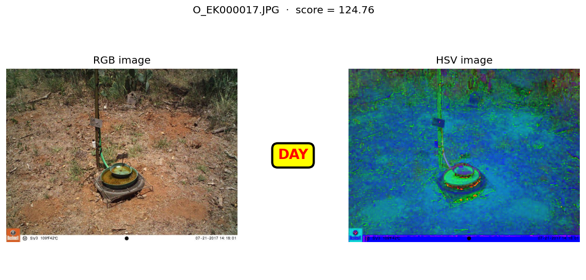

*A colourful daylight frame scores well above the threshold and is labelled DAY;
near-monochrome infra-red night frames score near zero and fall the other way.*

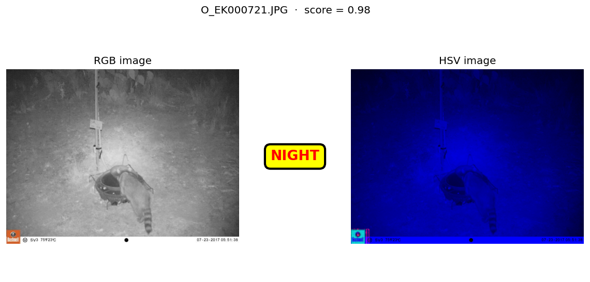

*Another camera-trap frame classified by the same mean Hue+Saturation score — no
per-image tuning, the one threshold decides every frame.*

### proj2 — Card Alignment (from scratch)
Detects a tilted playing card in a photo and **rotates it upright**, using only
image I/O and geometric transforms from a library — everything that solves the
problem is hand-built (no `minAreaRect`, `findContours`, `Canny`, or
`HoughLines`). The method mirrors the original MATLAB approach:

- **hand-written 2-D convolution** as the core primitive,
- a **box-blur** smoothing pass, then hand-written **Sobel** kernels in x and y
  combined into a **gradient magnitude** and thresholded to a binary **edge
  map**,
- the four **extreme points** of the edge pixels (topmost, bottommost, leftmost,
  rightmost) taken as the rotated rectangle's **corners**,
- the **rotation angle** computed from the longest side via `atan2`,
- a **geometric rotation + crop** to the upright bounding box, and a final
  **portrait** enforcement (rotate 90° if the crop came out landscape).

The angle math and corner detection — the graded parts — are written out
explicitly rather than delegated to a library.
**Data:** `data/proj2_data/`

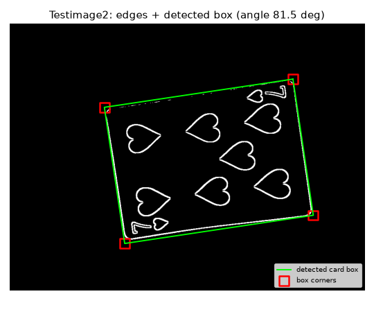

*The from-scratch Sobel edge map with the rotation-angle search's chosen upright
box (green) and its four corners (red).*

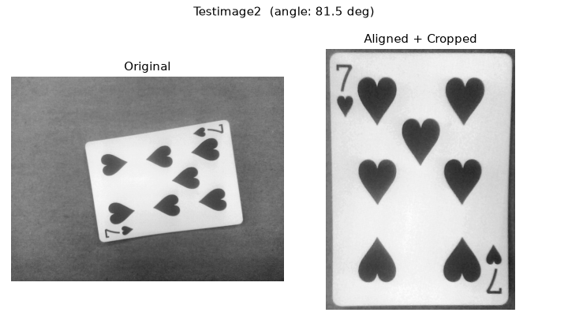

*The same card rotated upright and cropped to portrait orientation.*

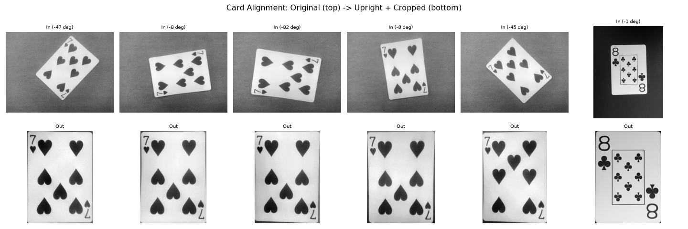

*A combined showcase of all the test cards, each detected and rotated upright by
the same from-scratch pipeline.*

### proj3 — Multi-Card Classifier
Finds and **counts** every playing card in an image, then classifies each card's
**rank** and **suit**. The pipeline chains from-scratch stages: binarize → fill
holes → **connected-component analysis** (find & count cards) → per card, mask →
rotate upright → crop and normalise to a canonical **400 × 300** → extract the
top-left ROI holding the small rank glyph and suit pip → segment the two blobs.

The two classifiers use deliberately different strategies:

- **Rank — features + a learned model.** The rank glyph is sharpened,
  ink-normalised onto a fixed canvas, described with a **from-scratch HOG**
  (Dalal–Triggs: gradient orientations binned per cell, blocks L2-normalised),
  standardised, and classified by a **scikit-learn linear SVM**. It is trained
  only on the hand-labelled training set (with augmentation); the labelled test
  cards are never used for training.
- **Suit — no ML at all.** The suit is decided by a **hand-structured threshold
  decision tree** over shape/image statistics; only the numeric thresholds were
  chosen from sample images (rules stored in `models/suit_thresholds.json`).

The project ships a trained rank model (`models/rank.pkl`) and small `scripts/`
for running the pipeline, training, evaluating labelled cards, and re-choosing
the suit thresholds.
**Data:** `data/proj3_data/`

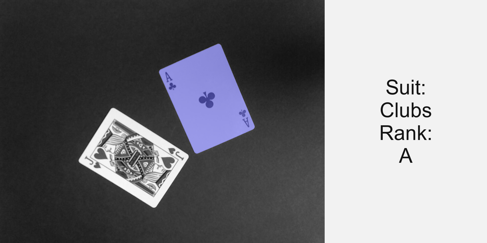

*One card segmented from a multi-card photo, rotated upright and normalised
before its rank and suit are read from the corner index.*

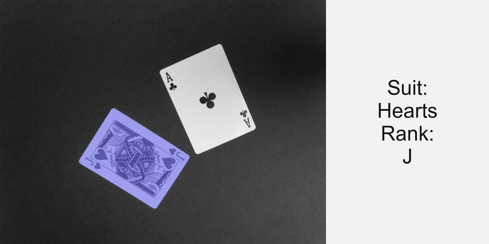

*Connected-component analysis finds and counts every card in the frame; each one
is then processed independently through the same rank/suit path.*

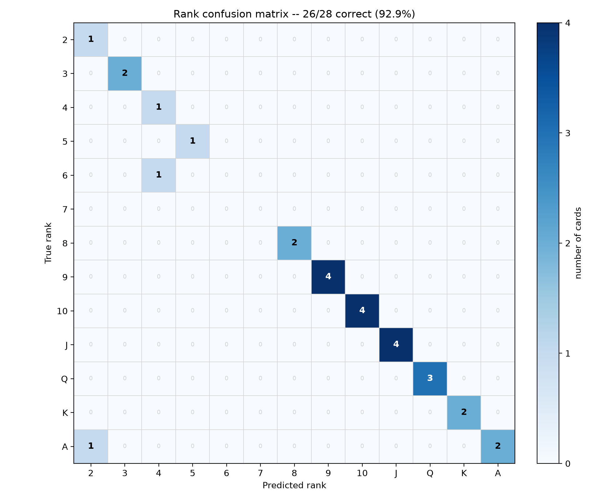

*Per-class rank performance on the labelled test cards (HOG + linear SVM).*

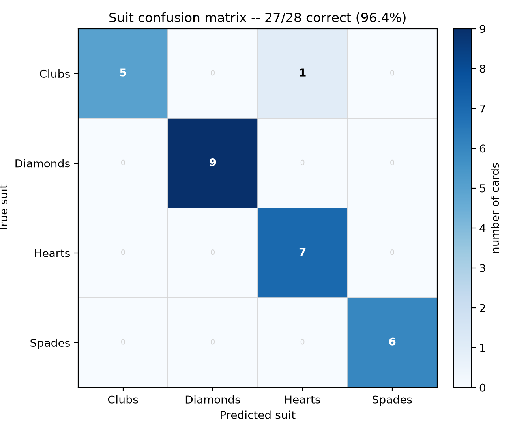

*Per-class suit performance from the threshold decision tree.*

### proj4 — Fourier Filtering
Two **frequency-domain** tasks on a periodic-pattern image, using **NumPy FFT**
with the DC term at index `(0, 0)` (matching the MATLAB frequency grid), and
**Butterworth** transfer functions built by hand:

- **Task 1 — extract the periodic pattern:** a **band-pass** (a high-pass × a
  low-pass, i.e. a ring of mid frequencies) combined with **spectral spike
  thresholding** that keeps only the dominant frequency peaks the pattern
  produces. The inner cut removes the illumination that a low-pass alone would
  leave as a bright central blob.
- **Task 2 — correct non-uniform illumination:** a **high-pass** that removes the
  slow brightness gradient sitting near DC while keeping texture.

All tunable cut-offs and orders live in `config.py`; the run produces
`Proj4_pattern.tif`, `Proj4_uniform.tif`, and a set of diagnostic figures.
**Data:** `data/proj4_data/`

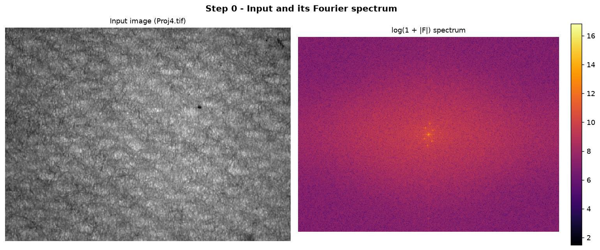

*The input and its Fourier spectrum; the periodic pattern shows up as discrete
spikes away from the bright DC centre.*

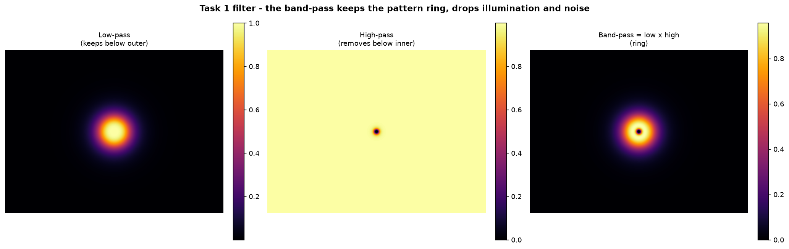

*The band-pass is constructed as a high-pass times a low-pass — a ring of mid
frequencies — so the pattern's spikes pass while DC illumination is rejected.*

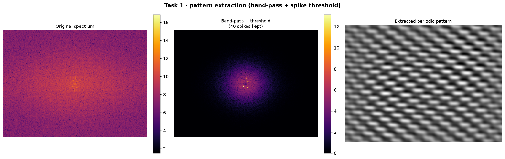

*Task 1: the periodic pattern isolated in the frequency domain and inverted back
to an image.*

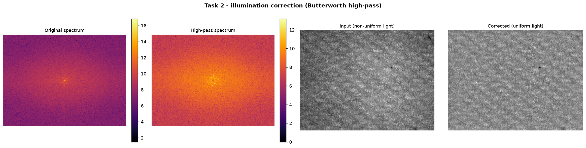

*Task 2: the high-pass removes the slow shading gradient, flattening the
illumination while preserving detail.*

### proj5 — C. elegans Worm Tracking
Segments and **tracks a *C. elegans* worm** through a video by removing the
static background and annotating every frame. A **mean-background model** is
built by inverse-Otsu-binarizing each frame (dark worm → foreground), averaging
those masks over the whole clip, and thresholding — leaving the stationary
background (grid, dish rim) to subtract away. Per frame:

- **background subtraction** followed by **8-connected component analysis** keeps
  the largest object as the worm,
- **morphology** cleans it up (an opening to break bubble/edge merges when the
  blob is unusually large, then a closing and hole-fill into a solid mask),
- the mask is **skeletonized**, and its **centerline is the longest path through
  the skeleton** (a double breadth-first search), whose two ends are the **head
  and tail**,
- **10 equidistant points** are sampled along the centerline and a **unit normal
  to the local tangent** (finite-difference tangent, rotated 90°) is drawn at
  each,
- an **OpenCV overlay** draws the worm, skeleton, bounding box, head/tail boxes,
  normals, and points.

The mean-background mask is cached to a `.pkl` and reused on later runs, and the
video is processed in a memory-flat two-pass stream.
**Data:** `data/proj5_data/`

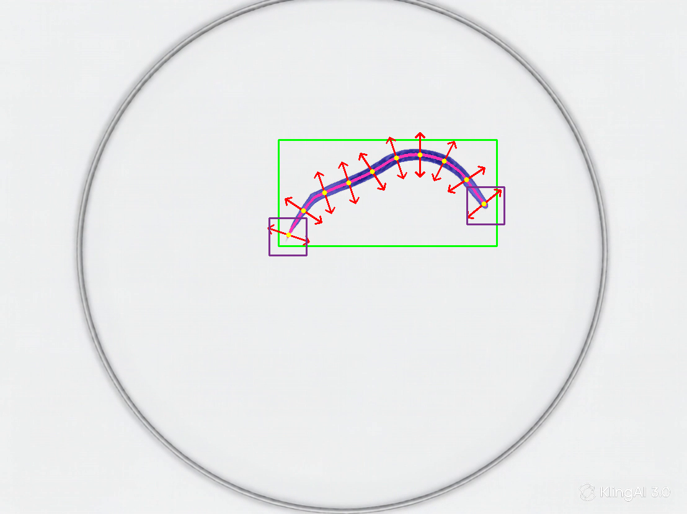

*A tracked frame: segmented worm (blue), skeleton (pink), bounding box (green),
head/tail boxes (purple), normal vectors (red), and equidistant points (yellow).*

---

## Data

> **The `data/` folder is not committed to this repository.**

The datasets are large (camera-trap photos, card images, and worm video), and
committing binaries to git would bloat every clone permanently, since git keeps
the full history of large files. So `data/` is git-ignored and you provide it
locally.

### Expected layout

```
data/
├── proj1_data/     # camera-trap frames                 (proj1)
├── proj2_data/     # tilted playing-card photos          (proj2)
├── proj3_data/     # single- and multi-card images +
│                   #   the hand-labelled training set     (proj3)
├── proj4_data/     # the periodic-pattern input image     (proj4)
└── proj5_data/     # the worm video (a single .avi)       (proj5)
```

Each project reads only from its own `data/projN_data/` subfolder, so you only
need the data for the projects you want to run. Paths are resolved by walking up
from the script to find the shared `data/` folder, so nothing is hard-coded to an
absolute location.

---

## Setup (uv)

This project uses **[uv](https://docs.astral.sh/uv/)** for dependency
management, so there is **no `requirements.txt`**. Dependencies are declared in
`pyproject.toml` and pinned in `uv.lock` for fully reproducible installs.

**1. Install uv** (if you don't already have it).
- Windows (PowerShell):
  ```powershell
  powershell -ExecutionPolicy ByPass -c "irm https://astral.sh/uv/install.ps1 | iex"
  ```
- macOS / Linux:
  ```bash
  curl -LsSf https://astral.sh/uv/install.sh | sh
  ```

**2. Install the dependencies.** From the repository root:
```bash
uv sync
```
This reads `pyproject.toml` and `uv.lock`, creates a virtual environment
(`.venv/`), and installs the exact locked versions. You do not create or manage
the venv by hand.

What the files do:
- **`pyproject.toml`** — declares the project and its dependencies.
- **`uv.lock`** — the resolved, locked versions `uv sync` installs from (commit
  this; it's what makes installs reproducible).
- **`.venv/`** — the environment uv creates. Not committed.

**3. Run a project** with `uv run`, which uses the project environment
automatically. The flat projects run their main script directly; the packaged
projects run through their `scripts/` entry point (no arguments — just run it):
```bash
uv run python proj1-daynight-classifier/daynight_main.py
uv run python proj2-card-align/card_align_main.py
uv run python proj3-multi-card-classifier/scripts/run_pipeline.py
uv run python proj4-fourier-filtering/scripts/proj4_main.py
uv run python proj5-celegan-tracking/scripts/run_worm_tracking.py
```

> **Shared environment:** all five projects share **one** virtual environment at
> the repository root — there is not a separate venv per project. Run `uv sync`
> once and every project is ready.

### Editor
These projects were written in **VS Code**. You don't need it, but if you hit
import or interpreter issues, VS Code makes them easy to avoid: open the repo
root as the workspace folder and select the `.venv` interpreter
(Ctrl/Cmd+Shift+P → "Python: Select Interpreter" → the `.venv` in the repo
root). For the packaged projects (proj3–proj5), pointing the editor's analysis at
each project's `src/` — via `python.analysis.extraPaths` in your workspace
settings — clears the "import could not be resolved" warning, since those
packages are added to the path at run time rather than installed. Several
scripts also open **matplotlib** windows, so run them in an environment with a
display rather than a headless terminal.

---

## Running the tests

Each project has a real **pytest** suite under its `tests/` folder. These are
genuine assertion-based tests — they *verify behaviour and fail when something
breaks*, not demonstrations that merely print output. They exist to catch
regressions: much of the code here is hand-written (convolution, Sobel, HOG,
Butterworth filters, the skeleton walk), so a test that pins down "the edge map
has the expected shape", "the band-pass is 1 at its centre frequency", or "the
skeleton centerline is ordered end-to-end" protects you the day an edit silently
breaks one of them.

### Run everything at once
From the repository root:
```bash
uv run python -m pytest
```
This discovers and runs every project's tests in one pass. Add detail or
brevity as needed:
```bash
uv run python -m pytest -v      # verbose: one line per test
uv run python -m pytest -q      # quiet: compact summary
```

> **Not using uv?** Every command below also works without the `uv run` prefix —
> just call `python -m pytest` directly. The only requirement is that the
> dependencies are installed in the active Python environment (e.g. you ran
> `uv sync` and activated `.venv`, or installed the packages another way). With
> uv, `uv run` handles the environment for you; without it, activate your
> environment first and drop the prefix:
> ```bash
> python -m pytest          # run everything
> python -m pytest -v       # verbose
> python -m pytest -q       # quiet
> ```

### Run one project
```bash
uv run python -m pytest "proj5-celegan-tracking"
# without uv:
python -m pytest "proj5-celegan-tracking"
```

### Run a single test file or test
```bash
uv run python -m pytest "proj5-celegan-tracking/tests/test_proj5_skeleton.py"
uv run python -m pytest "proj5-celegan-tracking/tests/test_proj5_skeleton.py::test_normal_is_unit_and_perpendicular"
# without uv:
python -m pytest "proj5-celegan-tracking/tests/test_proj5_skeleton.py"
```

### A note on the `conftest.py` files
Every project has a `conftest.py`, and it is **required** — without it the tests
fail with `ModuleNotFoundError`. There are two placements, matching the two
folder shapes:

- **Flat projects (proj1, proj2):** an **empty `conftest.py` at the project root**
  (next to the source files, not inside `tests/`). Its mere presence tells pytest
  to add the project folder to the import path so the test files in `tests/` can
  import the modules that live one level up.
- **Packaged projects (proj3, proj4, proj5):** a small **`conftest.py` inside
  `tests/`** that puts the project's `src/` (or package) directory on the import
  path, so `import proj5_ip …` resolves without installing anything.

**Don't delete these files** — they are what make imports work when pytest is run
from the repository root.
